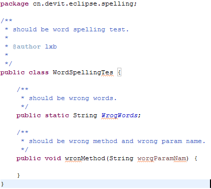

Devit-jdt
=========

patch org.eclipse.jdt to support some feature needed by everybody.

对org.eclipse.jdt做一些寻常开发中用到的补丁。

Features
-----------

### 支持驼峰命名的拼写检查（Spell checker support camel case in java source code）

检查JAVA源码中的类、方法、变量名的拼写，只检查声明的位置。

1. Patch default spelling engine to support check java package ,class ,method ,variable declaration and also support camel case.
We check:
- package declaration(last segment)
- class, method,parameter name
- any variable declaration

**Note:** We only check declaration part in order to minimum developer's attention.

We ignore:

- method with `@Override`

### 有用的代码模板（Some useful code template for java）

4个模板：newlist,newmap,newset

type `newlist` and hit content assistant key (alt+/ or ctrl+space) and select `newlist` template and code will show:

    //newlist
    List<T> V = new ArrayList<T>(10);
    //newmap
    Map<K, V> map = new HashMap<K, V>(10);
    //newset
    Set<K> set = new HashSet<K>(10);
    //logger
    //create static slf4j logger for class,and automatic import org.slf4j.Logger,org.slf4j.LoggerFactory
    //test
    //create @Test method,and automatic import org.junit.Assert.* ,org.hamcrest.Matchers

Screenshots
-----------

Install
---------

- In "Install New Software" dialog, paste update site url: http://devitcn.github.io/devit-jdt/ 
- Install plugins and restart
- Open Preferences, spelling,change spelling engine to "Default spelling engine path"

Plans
---------

0. hover, show field java doc
1. code assist to generate map to bean access. for example map.put("props" bean.getProps);
2. code complete sorter to access method unique in a block of code.
3. code iteration when c+a+up down
4. export java bean as json template.
5. some code template.
6. file link: jump link in service test jsp js and properties. click link on jsp or js jump to controller or js file support expression evaluate.
7. run/debug last launched
8. 
9. 

License
---------------

[Eclipse Public License - v 1.0](http://www.eclipse.org/legal/epl-v10.html "Eclipse Public License - v 1.0")
